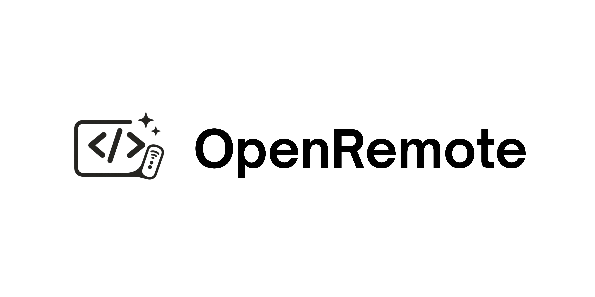
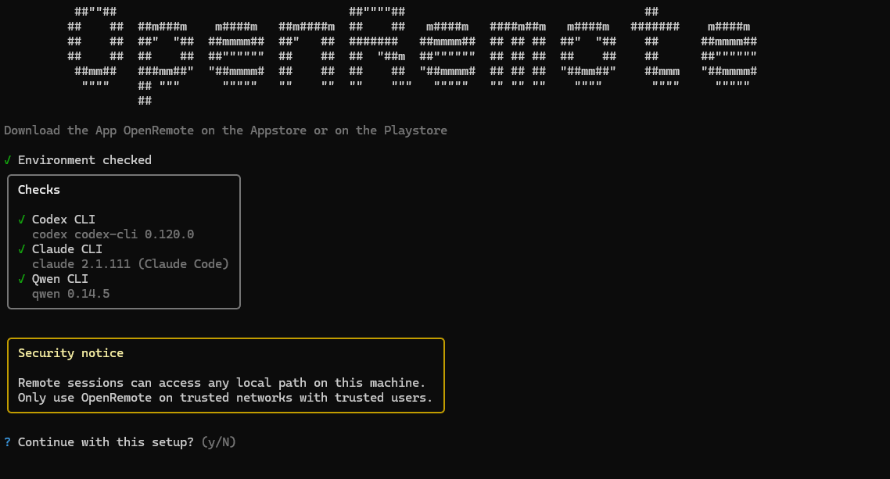
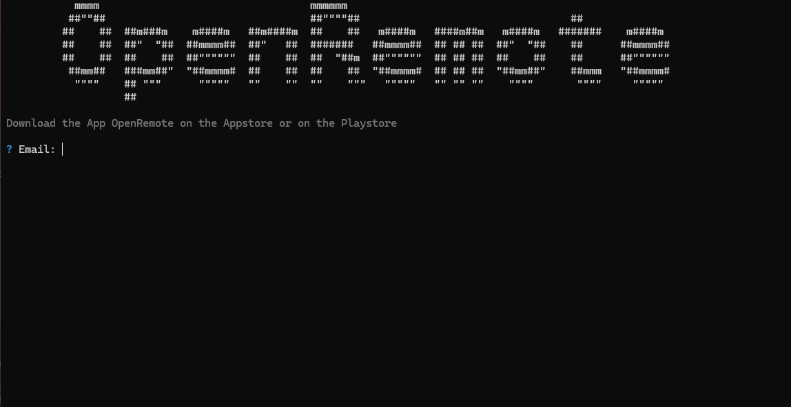
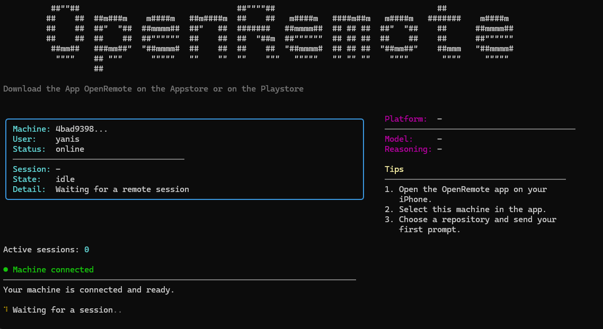
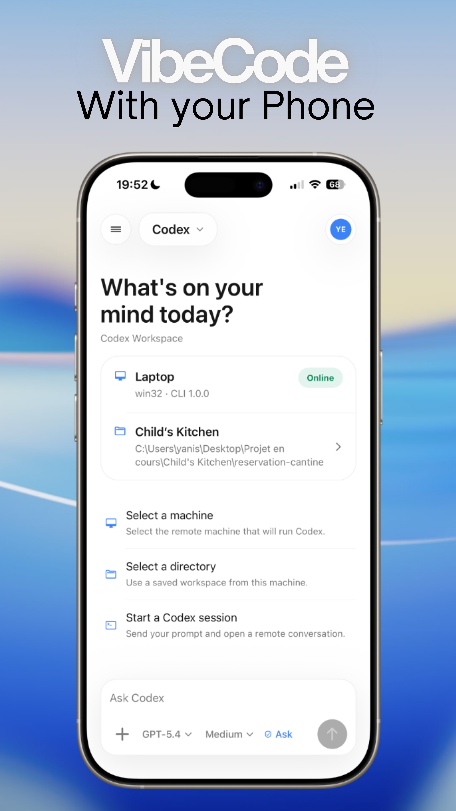

<div align="center">
  
  <h1>OpenRemote — CLI</h1>
  <p><strong>Control your AI coding agent from your iPhone.</strong></p>
  <p>Run Codex, Qwen, or Claude on your machine and pilot every session remotely from the Codex Remote mobile app.</p>
</div>

---

## Table of Contents

1. [Overview](#overview)
2. [Prerequisites](#prerequisites)
3. [Installation](#installation)
4. [Step 1 — Setup](#step-1--setup)
5. [Step 2 — Login](#step-2--login)
6. [Step 3 — Start](#step-3--start)
7. [Command Reference](#command-reference)
8. [Mobile App](#mobile-app)

---

## Overview

Codex Remote is a two-part platform:

- **CLI** — runs on your development machine (Windows, macOS, Linux) and bridges your local AI coding agent (Codex, Qwen, or Claude) to the internet via a secure Supabase channel.
- **Mobile app** — an iPhone and Android app that lets you send prompts, view live output, and approve actions from anywhere.

This README covers the **CLI** setup and usage. Once the CLI is running, you can connect to it from the mobile app and start coding sessions remotely.

---

## Prerequisites

Before installing the CLI, make sure you have the following on your machine:

- **Node.js 18 or higher** — [nodejs.org](https://nodejs.org)
- **At least one supported AI agent** installed globally:
  - [OpenAI Codex](https://github.com/openai/codex): `npm install -g @openai/codex`
  - [Qwen CLI](https://github.com/QwenLM/qwen-agent): `npm install -g @alibaba-cloud/qwen-cli`
  - [Claude Code](https://github.com/anthropics/claude-code): `npm install -g @anthropic-ai/claude-code`

You only need **one** of the three agents — the CLI will detect which ones are available automatically.

---

## Installation

### Option 1 — Install from npm (recommended)

```bash
npm install -g openremote
```

### Option 2 — Build from source

Clone the repository and install the CLI dependencies:

```bash
git clone https://github.com/YnsELY/openremote-cli.git
cd openremote/cli
npm install
npm run build
```

Once built, you can run the CLI using:

```bash
node dist/index.js <command>
```

Or link it globally to use the `openremote` command from anywhere:

```bash
npm link
openremote <command>
```

---

## Step 1 — Setup

The `setup` command checks your environment and creates the local configuration file needed to run the CLI.

```bash
openremote setup
```

**What it does:**

- Verifies your Node.js version
- Detects which AI agents are installed (Codex, Qwen, Claude)
- Displays a readiness checklist
- Generates a unique machine ID
- Creates the config file on your system:
  - **Windows:** `%APPDATA%\CodexRemote\config.json`
  - **macOS:** `~/Library/Application Support/CodexRemote/config.json`
  - **Linux:** `~/.config/CodexRemote/config.json`

Run `setup` only once per machine. After it completes, proceed to `login`.

<div align="center">
  
</div>

---

## Step 2 — Login

The `login` command authenticates your account and links this machine to it.

```bash
openremote login
```

**What it does:**

- Prompts for your Codex Remote email and password
- Authenticates against the backend
- Stores a machine token locally (never your password)
- Associates this machine with your account so the mobile app can find it

Once logged in, your machine is registered and ready to receive remote sessions. You can now run `openremote start`.

<div align="center">
  
</div>

---

## Step 3 — Start

The `start` command connects your machine to the backend and keeps it listening for incoming sessions from the mobile app.

```bash
openremote start
```

**What it does:**

- Validates your configuration and credentials
- Opens a live dashboard showing machine status, provider info, and session activity
- Connects to Supabase Realtime and waits for session requests from your phone
- When a session starts, spawns the selected AI agent (Codex, Qwen, or Claude) in a local terminal
- Streams all output — commands, code, thoughts, errors — back to the mobile app in real time
- Handles approval requests interactively through the app

**Keep this terminal open.** The CLI must be running for the mobile app to connect and send sessions.

Press `Ctrl+C` to stop and disconnect.

<div align="center">
  
</div>

---

## Command Reference

```
Usage: openremote [options] [command]

Control your AI coding agent from your iPhone

Options:
  -V, --version   output the version number
  --verbose       Show debug output below the UI
  -h, --help      display help for command

Commands:
  setup           Check CLI dependencies and create local configuration
  login           Authenticate and link this machine to your account
  start           Connect to the backend and accept remote sessions
  status          Show current configuration, credentials, and readiness
  doctor          Run full diagnostics on your environment
  logout          Remove stored credentials from this machine
  help [command]  Display help for a specific command
```

### Additional commands

| Command | Description |
|---|---|
| `openremote status` | Quick summary of whether the machine is configured and ready to `start` |
| `openremote doctor` | Full diagnostic — checks Node.js, installed agents, config file, auth token, and connectivity |
| `openremote logout` | Clears stored credentials; run `login` again to re-authenticate or switch accounts |

---

## Mobile App

The **Codex Remote** mobile app is the remote control for your machine. Once `openremote start` is running, download the app and sign in with the same account you used in `openremote login`.

### Step 4 — Connect from your phone

1. **Download the app**
   - iOS: [App Store](#) *(coming soon)*
   - Android: [Google Play](#) *(coming soon)*

2. **Sign in** with the same email and password you used with `openremote login`

3. **Select your machine** from the list — it will appear as online once `openremote start` is running

4. **Choose a workspace** (a local directory on your machine) and an AI agent (Codex, Qwen, or Claude)

5. **Send a prompt** — the session starts on your machine and you see live output directly on your phone

6. **Approve or reject actions** — when the agent asks for confirmation, a card appears in the app for you to validate directly from your phone

The app gives you full visibility into what the agent is doing: every command it runs, every file it edits, every thought it has — all streamed live to your screen in a clean, readable format.

<div align="center">
  
</div>

---

<div align="center">
  <sub>Built with Node.js · Supabase · React Native · Expo</sub>
</div>
